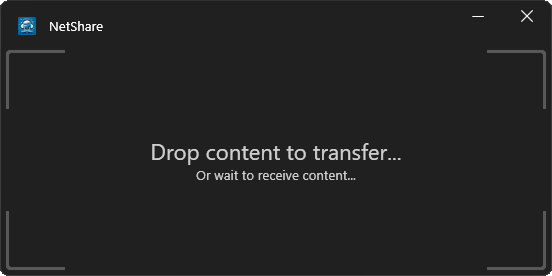
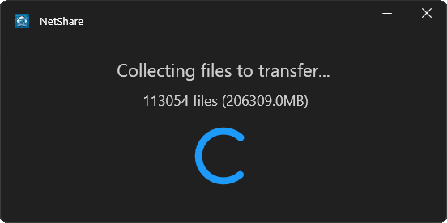
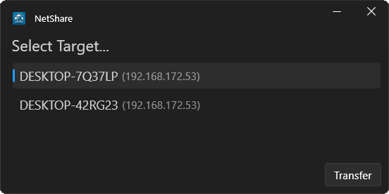
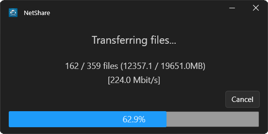

# NetShare
A C#/.NET8 WPF windows application to drag/drop files and folders to transfer them in the local area network.

## Dependencies
The repo contains VS2022 solution and project files and uses C#12/.NET 8/WPF.
Dependencies are available on NuGet and GitHub:
- [Microsoft.Extensions.DependencyInjection](https://www.nuget.org/packages/Microsoft.Extensions.DependencyInjection/) for dependency injection (Configuration in App.cs)
- [Microsoft.Xaml.Behaviors.Wpf](https://github.com/microsoft/XamlBehaviorsWpf) for improved xaml command bindings
- [WPF-UI](https://github.com/lepoco/wpfui) for a modern wpf UI design

## Instructions
0 - [Optional] Right click title bar to change settings

1 - Drag and drop content to transfer, or wait to receive content

2 - Wait while the application collects all files

3 - Select the target

4 - Wait for the receiver to confirm and the transfer to complete

